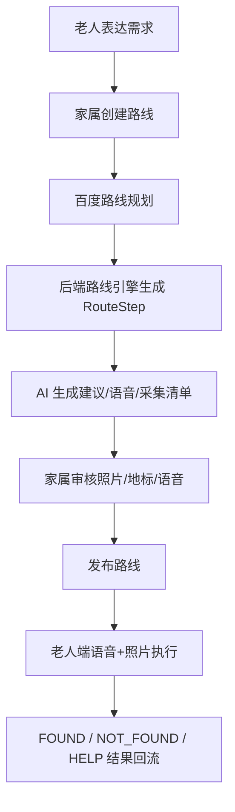

# 系统总览

家路通是帮助老人安全出行的家庭协同系统，不是地图软件，也不是 AI 自动导航产品。

## 核心流程

老人表达需求，地图负责算路，AI 负责减负，家庭成员负责确认，老人端负责执行。

## 主要子系统

- 小程序老人端：读取已发布路线、播放语音、显示照片、记录执行结果。
- 小程序家属端：创建草稿、查看 AI 建议、采集照片语音、审核发布。
- 后端 API：微信登录、家庭隔离、路线规划、RouteStep 生成、AI、TTS、文件上传、行程结果。
- 外部服务：百度地图、阿里百炼、腾讯云 TTS。

## 数据权威边界

- Route、RouteStep、审核状态、发布状态以服务端为准。
- 小程序只缓存老人端可执行路线，用于弱网兜底。
- 前端不得维护独立路线引擎实现。
